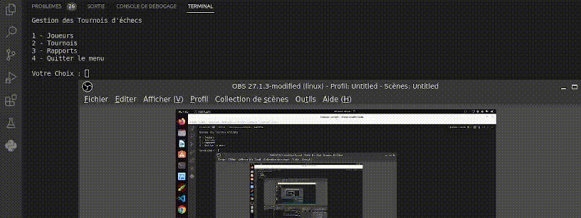

<h3 align="center">
    
     
</h3>

# OpenClassrooms - Formation Développeur d'application Python - Projet 04
Développez un programme logiciel en Python

* [Python](https://www.python.org/)

(<a href="#top">back to top</a>)

## Installation
1. <a href="#python-installation">Installation Python</a> ;
2. Cloner le projet  ;
  
   git clone https://github.com/MohandArezki/OC_DevPython_P4.git
 
3. Créer l'environnement virtuel *(plus de détails  [Creating a virtual environment](https://packaging.python.org/en/latest/guides/installing-using-pip-and-virtual-environments/#creating-a-virtual-environment))* ;
    * Windows :
      
      python -m venv env
      
    * Linux :
      
      python3 -m venv env
      
4. Activer l'environnement virtuel :
    * Windows :
      
      .\env\Scripts\activate
      
    * Linux :
      
      source env/bin/activate
      
5. Installer les packages de requirements.txt ;
   
   pip install -r requirements.txt

6. Accéder au dossier du projet ;
  
   cd path/to/projet

7. Excecuter le programm 
   
   python3 main.py 

(<a href="#top">back to top</a>)
<!-- USAGE EXAMPLES -->

### How to ?   

